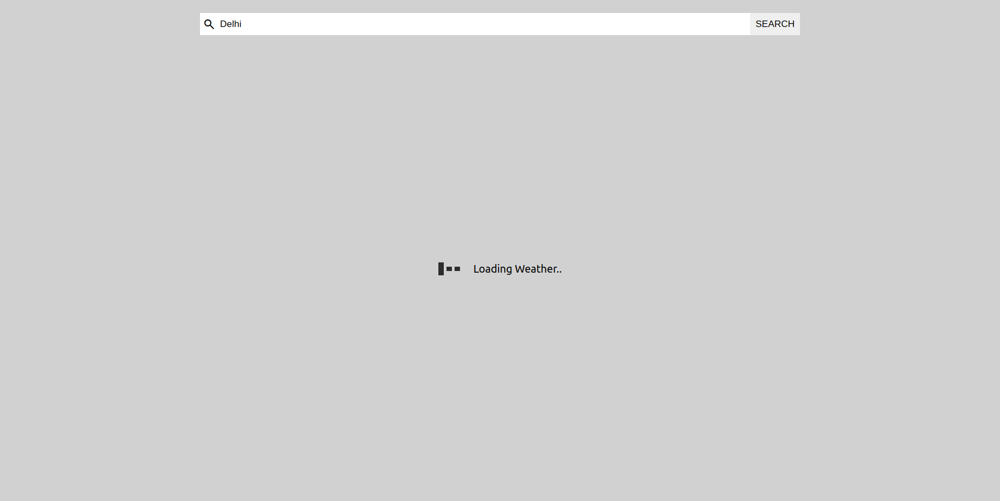
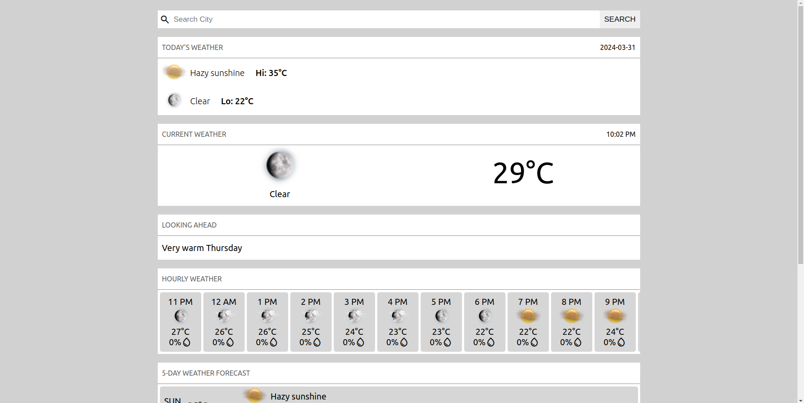
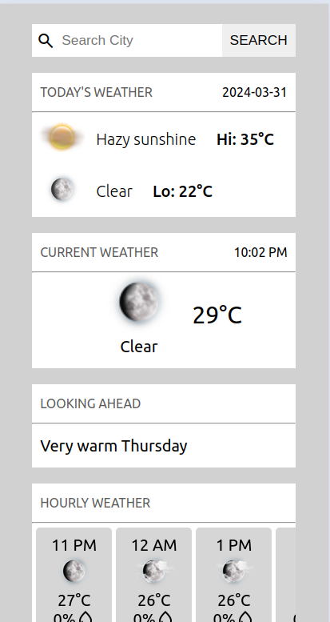

# Weather App
This is a simple weather application built using React. It allows users to search for weather information based on location.
## Features

- **Search by City:** Users can enter the name of a city to retrieve weather information.
- **Current Weather:** Displays the current weather conditions including temperature, humidity, wind speed, etc.
- **Temperature:** Provides information on the current temperature, as well as the highest and lowest temperatures for the day.
- **Probability of Precipitation:** Shows the likelihood of precipitation occurring in the specified location.
- **Responsive Design:** The app is designed to be responsive and works well on various screen sizes.
- **Next 12 Hours Forecast:** Offers a forecast for the weather conditions expected in the next 12 hours.
- **Next 5 Days Forecast:** Provides a forecast for the weather conditions expected over the next 5 days.


## Installation

1. Clone the repository:

```bash
  git clone https://github.com/VedantDewangan/Weather-App.git
```

2. Install dependencies:

```bash
  npm install
```
3. Obtain AccuWeather API Key:

    To retrieve weather data, you need an API key from AccuWeather. If you don't have one, you can sign up for a free account on the AccuWeather Developer Portal: [AccuWeather Developer Portal](https://developer.accuweather.com/).

    Once you have obtained your API key, create a `.env.local` file in the root directory of your project and add the following line, replacing `YOUR_API_KEY` with your actual API key:

    ```plaintext
    VITE_WEATHER_APP_API_KEY=YOUR_API_KEY
    ```
## Usage

1. Start the development server:

    ```bash
    npm run dev
    ```

2. Open your browser and visit [http://localhost:5173](http://localhost:5173) to view the app.

## Dependencies


- [React](https://reactjs.org/)
- [Axios](https://github.com/axios/axios) (for making HTTP requests)
- [react-router-dom](https://reactrouter.com/web/guides/quick-start) (for routing within the React app)


## Contributing

Contributions are welcome! If you find any issues or have suggestions for improvements, please open an issue or submit a pull request.

## Environment Variables

To run this project, you will need to add the following environment variables to your .env file

`VITE_WEATHER_APP_API_KEY`

## Screenshots





## Contributing

Contributions are welcome! If you find any issues or have suggestions for improvements, please open an issue or submit a pull request.